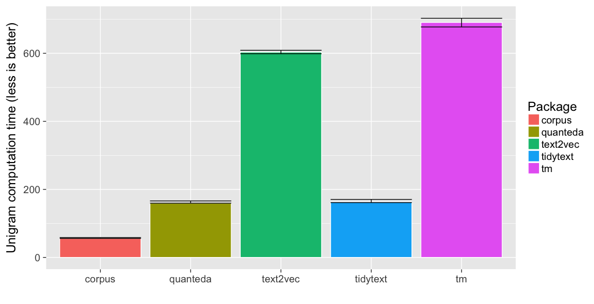
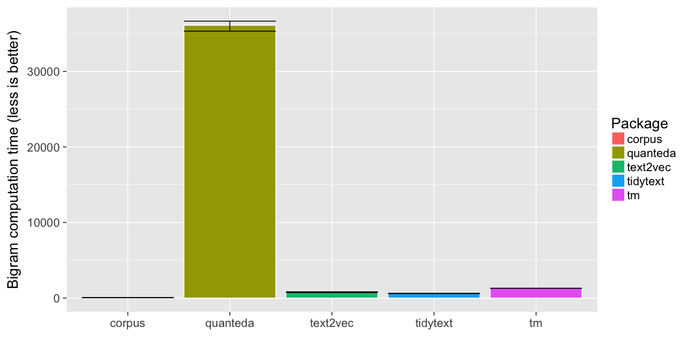
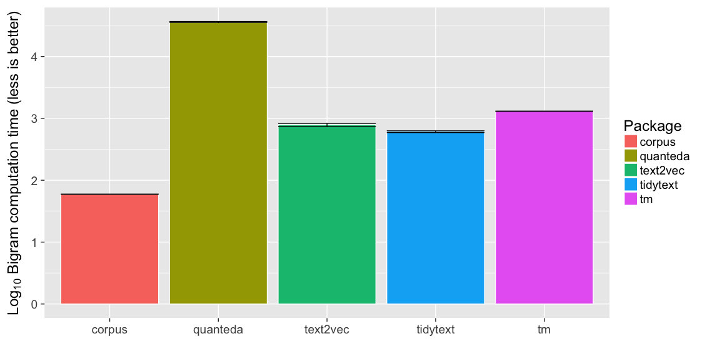

Term Matrix Speed Contest
=========================

Overview
--------

There are multiple R packages that can transform text data into a matrix
of term frequency counts. This document benchmarks five packages:

-   [corpus](https://github.com/patperry/r-corpus)
-   [quanteda](https://github.com/kbenoit/quanteda)
-   [text2vec](http://text2vec.org/)
-   [tidytext](https://github.com/juliasilge/tidytext)
-   [tm](http://tm.r-forge.r-project.org/)

There are two benchmarks, one for unigrams only, and one for unigrams
and bigrams. In each benchmark, we perform the following sequence of
operations:

-   case fold the text
-   tokenize into words
-   remove puncuation
-   remove numbers
-   remove stop words
-   stem
-   compute bigrams (second benchmark only)
-   compute term frequencies
-   remove terms that appear fewer than five times in the corpus
-   compute a term frequency matrix (text by term)

There are some subtle and not-so-subtle differences in how the five
packages implement these operations, so this is not really an
apples-to-apples comparison, and the outputs are different. Keep that in
mind.

Prelude
-------

We will load the following packages.

    library("dplyr", warn.conflicts = FALSE)
    library("ggplot2")
    library("magrittr")
    library("methods")
    library("stringr")

The remaining packages need to be installed, but we will not load their
namespaces:

    # Not run:
    # install.packages(c("corpus", "microbenchmark", "quanteda", "text2vec", "tidytext", "tm"))

For test data, we use the chapters from *Pride and Prejudice*, provided
by the [janeaustenr](https://github.com/juliasilge/janeaustenr) library.

    lines <- (data_frame(text = janeaustenr::prideprejudice)
              %>% mutate(
        linenumber = row_number(),
        chapter = cumsum(str_detect(text, regex("^chapter [\\divxlc]",
                                                ignore_case = TRUE)))))
    text <- c(tapply(lines$text, lines$chapter, paste, collapse = "\n"))

We will use the Snowball English stop word list.

    stop_words <- corpus::stopwords("english")

Packages
--------

### corpus

    matrix_corpus <- function(text, bigrams = FALSE, min_count = 5)
    {
        if (bigrams) {
            ngrams <- 1:2
        } else {
            ngrams <- 1
        }
        f <- corpus::token_filter(stemmer = "english", drop_punct = TRUE,
                                  drop_number = TRUE, drop = stop_words)
        stats <- corpus::term_counts(text, f, ngrams = ngrams, min = min_count)
        x <- corpus::term_matrix(text, f, select = stats$term)
        x
    }

### quanteda

    matrix_quanteda <- function(text, bigrams = FALSE, min_count = 5)
    {
        if (bigrams) {
            ngrams <- 1:2
        } else {
            ngrams <- 1
        }
        x <- quanteda:::dfm(text, stem = TRUE, remove_punct = TRUE,
                           remove_numbers = TRUE, remove = stop_words,
                           ngrams = ngrams, verbose = FALSE)
        x <- quanteda::dfm_trim(x, min_count = min_count, verbose = FALSE)
        x
    }

### text2vec

    # adapted from text2vec itoken documentation:
    stem_tokenizer <- function(x)
    {
        text2vec::word_tokenizer(x) %>% lapply(SnowballC::wordStem, "en")
    }

    # Note: this filters punctuation but keeps numbers
    matrix_text2vec <- function(text, bigrams = FALSE, min_count = 5)
    {
        if (bigrams) {
            ngram <- c(1, 2)
        } else {
            ngram <- c(1, 1)
        }
        it_train <- text2vec::itoken(text,
                                     preprocessor = tolower,
                                     tokenizer = stem_tokenizer,
                                     ids = seq_along(text),
                                     progressbar = FALSE)
        vocab <- text2vec::create_vocabulary(it_train, ngram = ngram,
                                             stopwords = stop_words)
        pruned_vocab <- text2vec::prune_vocabulary(vocab,
                                                   term_count_min = min_count)
        vectorizer <- text2vec::vocab_vectorizer(pruned_vocab)
        x <- text2vec::create_dtm(it_train, vectorizer)
        x
    }

### tidytext

    # Note: this filters punctuation but keeps numbers
    matrix_tidytext <- function(text, bigrams = FALSE, min_count = 5)
    {
        data <- tibble::tibble(text_id = seq_along(text), text = text)
        stops <- tibble::tibble(word = stop_words)

        x <- (data %>% tidytext::unnest_tokens(word, text)
                    %>% anti_join(stops, by = "word")
                    %>% mutate(word = SnowballC::wordStem(word, "english"))
                    %>% count(text_id, word)
                    %>% ungroup()
                    %>% tidytext::cast_dtm(text_id, word, n))
        x <- x[, slam::col_sums(x) >= min_count, drop = FALSE]

        if (bigrams) {
            x2 <- (data %>% tidytext::unnest_tokens(bigram, text,
                                                    token = "ngrams", n = 2)
                        %>% tidyr::separate(bigram, c("type1", "type2"), sep = " ")
                        %>% filter(!type1 %in% stop_words,
                                   !type2 %in% stop_words)
                        %>% mutate(type1 = SnowballC::wordStem(type1, "english"),
                                   type2 = SnowballC::wordStem(type2, "english"))
                        %>% mutate(term = paste(type1, type2))
                        %>% count(text_id, term)
                        %>% ungroup()
                        %>% tidytext::cast_dtm(text_id, term, n))
            x2 <- x2[, slam::col_sums(x2) >= min_count, drop = FALSE]

            x <- cbind(x, x2)
        }

        x
    }

### tm

    # from http://tm.r-forge.r-project.org/faq.html#Bigrams
    BigramTokenizer <- function(x)
    {
        unlist(lapply(NLP::ngrams(NLP::words(x), 2), paste, collapse = " "),
               use.names = FALSE)
    }

    matrix_tm <- function(text, bigrams = FALSE, min_count = 5)
    {
        corpus <- (tm::VCorpus(tm::VectorSource(text))
                   %>% tm::tm_map(tm::content_transformer(tolower))
                   %>% tm::tm_map(tm::removeWords, stop_words)
                   %>% tm::tm_map(tm::removePunctuation)
                   %>% tm::tm_map(tm::removeNumbers)
                   %>% tm::tm_map(tm::stemDocument, language = "english"))

        control <- list(wordLengths = c(1, Inf),
                        bounds = list(global = c(min_count, Inf)))

        x <- tm::DocumentTermMatrix(corpus, control = control)

        if (bigrams) {
            control$tokenize <- BigramTokenizer
            x2 <- tm::DocumentTermMatrix(corpus, control = control)

            x <- cbind(x, x2)
        }
        x
    }

Caveats
-------

These packages all give different results. See, for example, the results
on the following sample text:

    sample <- "A sentence. Another sentence. Others..."
    as.matrix(matrix_corpus(sample, bigrams = TRUE, min_count = 1)) # corpus

         sentenc anoth anoth sentenc
    [1,]       2     1             1

    as.matrix(matrix_quanteda(sample, bigrams = TRUE, min_count = 1)) # quanteda

    No features removed.

           features
    docs    sentenc anoth other sentenc_anoth anoth_sentenc sentenc_other
      text1       2     1     1             1             1             1

    as.matrix(matrix_text2vec(sample, bigrams = TRUE, min_count = 1)) # text2vec

      anoth_sentenc anoth sentenc_anoth sentenc
    1             1     1             1       2

    as.matrix(matrix_tidytext(sample, bigrams = TRUE, min_count = 1)) # tidytext

      anoth other sentenc anoth sentenc sentenc anoth sentenc other
    1     1     1       2             1             1             1

    as.matrix(matrix_tm(sample, bigrams = TRUE, min_count = 1)) # tm

      anoth other sentenc anoth sentenc sentenc anoth sentenc other
    1     1     1       2             1             1             1

Two major differences between the packages:

1.  With the *quanteda*, *tidytext*, and *tm* packages, we remove stop
    words first, and then stem. With *text2vec*, we stem and then remove
    stop words. *Corpus* removes stop words after stemming and by
    default does not stem any words on the drop list. The word "other"
    is a stop word, but "others" is not. However, "others" stems to
    "other". *Corpus* and *text2vec* remove "others"; *quanteda*,
    *tidytext*, and *tm* replace "others" with a non-dropped "other"
    token. Another example: "above" is a stop word that stems to "abov".
    *Text2vec* replaces "above" with "abov" and keeps the token; the
    other packages drop "above".

2.  By design, *corpus* does not form bigrams across dropped tokens, in
    particular across dropped punctuation. The other packagages form
    bigrams from "sentence. Another" and "sentence. Others"; corpus does
    not.

There are also differences in the output format. *Corpus*, *quanteda*,
and *text2vec* return *Matrix* objects, but *tidytext* and *tm* return
*slam* objects.

Results
-------

### Unigrams

Here are the results for the unigram benchmark.

    results1 <- microbenchmark::microbenchmark (
        corpus = matrix_corpus(text, bigrams = FALSE),
        quanteda = matrix_quanteda(text, bigrams = FALSE),
        text2vec = matrix_text2vec(text, bigrams = FALSE),
        tidytext = matrix_tidytext(text, bigrams = FALSE),
        tm = matrix_tm(text, bigrams = FALSE),
        times = 5)
    print(results1)

    Unit: milliseconds
         expr       min        lq      mean   median        uq      max neval
       corpus  55.45414  55.93859  57.27817  56.0092  58.33122  60.6577     5
     quanteda 154.69573 159.47942 161.37088 159.6544 166.12597 166.8989     5
     text2vec 591.34491 598.80828 612.92413 603.3281 608.80545 662.3339     5
     tidytext 157.56603 161.23702 166.18409 162.6630 170.46437 178.9901     5
           tm 676.11487 677.41971 700.05908 690.6987 702.96902 753.0931     5

    (ggplot(summary(subset(results1)),
            aes(x = expr, fill = expr, y = median, ymin = lq, ymax = uq))
     + geom_bar(color = "white", stat = "identity")
     + geom_errorbar()
     + scale_fill_discrete(name = "Package")
     + xlab("")
     + ylab("Unigram computation time (less is better)"))

### Bigrams

Here are the results for the bigram benchmark.

    results2 <- microbenchmark::microbenchmark (
        corpus = matrix_corpus(text, bigrams = TRUE),
        quanteda = matrix_quanteda(text, bigrams = TRUE),
        text2vec = matrix_text2vec(text, bigrams = TRUE),
        tidytext = matrix_tidytext(text, bigrams = TRUE),
        tm = matrix_tm(text, bigrams = TRUE),
        times = 5)
    print(results2)

    Unit: milliseconds
         expr         min          lq        mean      median          uq         max neval
       corpus    58.87614    59.14485    59.46941    59.31266    59.82001    60.19338     5
     quanteda 35314.12378 35323.98521 36131.27155 36101.62558 36649.21610 37267.40707     5
     text2vec   709.24007   734.55120   814.43909   789.69141   830.66338  1008.04938     5
     tidytext   577.91370   589.58277   616.03104   616.40797   628.75712   667.49363     5
           tm  1278.09123  1298.47515  1306.46740  1307.18267  1308.95228  1339.63568     5

    (ggplot(summary(results2),
            aes(x = expr, fill = expr, y = median,
                ymin = lq, ymax = uq))
     + geom_bar(color = "white", stat = "identity")
     + geom_errorbar()
     + scale_fill_discrete(name = "Package")
     + xlab("")
     + ylab("Bigram computation time (less is better)"))

It's hard to see the differences on an absolute scale, so I'm including
a plot on a log (base 10) scale:

    (ggplot(summary(results2),
            aes(x = expr, fill = expr, y = log10(median),
                ymin = log10(lq), ymax = log10(uq)))
     + geom_bar(color = "white", stat = "identity")
     + geom_errorbar()
     + scale_fill_discrete(name = "Package")
     + xlab("")
     + ylab(expression(paste(Log[10],
                             " Bigram computation time (less is better)"))))

Summary
-------

For the unigram benchmark, *corpus* is 3 times faster than *quanteda*
and *tidytext*, and 10 times faster than *text2vec* and *tm*.

For the bigram benchmark, *corpus* is 10 times faster than *text2vec*
and *tidytext*, 20 times faster than *tm*, and 500 times faster than
*quanteda*. (I'm not sure why the *quanteda* results are so bad, I might
be doing something wrong.)

Session information
-------------------

    sessionInfo()

    R version 3.4.0 (2017-04-21)
    Platform: x86_64-apple-darwin16.5.0 (64-bit)
    Running under: macOS Sierra 10.12.5

    Matrix products: default
    BLAS: /System/Library/Frameworks/Accelerate.framework/Versions/A/Frameworks/vecLib.framework/Versions/A/libBLAS.dylib
    LAPACK: /System/Library/Frameworks/Accelerate.framework/Versions/A/Frameworks/vecLib.framework/Versions/A/libLAPACK.dylib

    locale:
    [1] en_US.UTF-8/en_US.UTF-8/en_US.UTF-8/C/en_US.UTF-8/en_US.UTF-8

    attached base packages:
    [1] methods   stats     graphics  grDevices utils     datasets  base     

    other attached packages:
    [1] stringr_1.2.0 magrittr_1.5  dplyr_0.5.0   ggplot2_2.2.1

    loaded via a namespace (and not attached):
     [1] NLP_0.1-10             Rcpp_0.12.11           quanteda_0.9.9-65      compiler_3.4.0         plyr_1.8.4            
     [6] tokenizers_0.1.4       iterators_1.0.8        tools_3.4.0            digest_0.6.12          nlme_3.1-131          
    [11] evaluate_0.10          tibble_1.3.0           gtable_0.2.0           lattice_0.20-35        psych_1.7.5           
    [16] Matrix_1.2-9           fastmatch_1.1-0        foreach_1.4.3          DBI_0.6-1              microbenchmark_1.4-2.1
    [21] parallel_3.4.0         janeaustenr_0.1.4      knitr_1.16             text2vec_0.4.0         rprojroot_1.2         
    [26] grid_3.4.0             data.table_1.10.4      R6_2.2.1               foreign_0.8-67         rmarkdown_1.5         
    [31] purrr_0.2.2.2          tidyr_0.6.3            reshape2_1.4.2         backports_1.0.5        scales_0.4.1          
    [36] SnowballC_0.5.1        codetools_0.2-15       htmltools_0.3.6        corpus_0.6.0           mnormt_1.5-5          
    [41] assertthat_0.2.0       tidytext_0.1.2         colorspace_1.3-2       labeling_0.3           stringi_1.1.5         
    [46] lazyeval_0.2.0         RcppParallel_4.3.20    munsell_0.4.3          slam_0.1-40            tm_0.7-1              
    [51] broom_0.4.2
