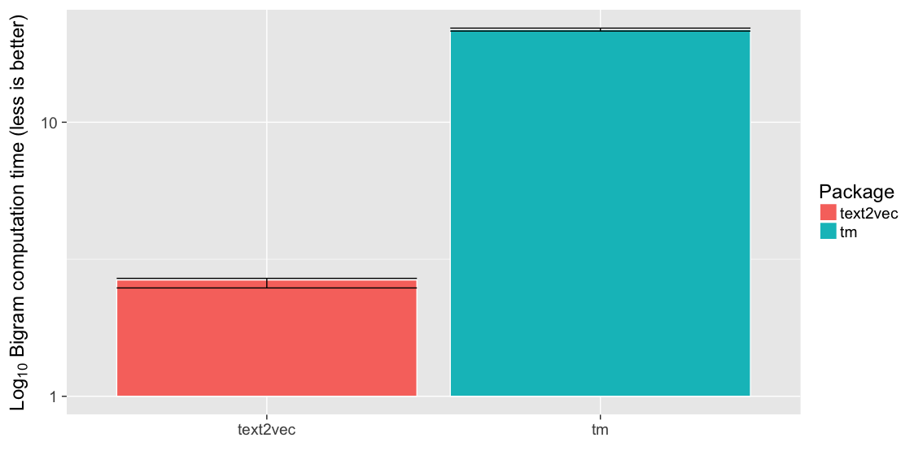

Term Matrix Speed Contest
=========================

Overview
--------

There are multiple R packages that can transform text data into a matrix
of term frequency counts. This document benchmarks five packages:

-   [corpus](https://github.com/patperry/r-corpus)
-   [quanteda](https://github.com/kbenoit/quanteda)
-   [text2vec](http://text2vec.org/)
-   [tidytext](https://github.com/juliasilge/tidytext)
-   [tm](http://tm.r-forge.r-project.org/)

There are two benchmarks, one for unigrams only, and one for unigrams
and bigrams. In each benchmark, we perform the following sequence of
operations:

-   case fold the text
-   tokenize into words
-   remove puncuation
-   remove numbers
-   remove stop words
-   stem
-   compute bigrams (second benchmark only)
-   compute term frequencies
-   remove terms that appear fewer than five times in the corpus
-   compute a term frequency matrix (text by term)

There are some subtle and not-so-subtle differences in how the five
packages implement these operations, so this is not really an
apples-to-apples comparison, and the outputs are different. Keep that in
mind.

Prelude
-------

We will load the following packages.

    library("dplyr", warn.conflicts = FALSE)
    library("ggplot2")
    library("magrittr")
    library("methods")
    library("stringr")

The remaining packages need to be installed, but we will not load their
namespaces:

    # Not run:
    # install.packages(c("corpus", "microbenchmark", "quanteda", "text2vec", "tidytext", "tm"))
    # devtools::install_github("dselivanov/text2vec@5a778fb517082c4a4a69f84dd5e9d045a18bc0bf")

For test data, we use the chapters from *Pride and Prejudice*, provided
by the [janeaustenr](https://github.com/juliasilge/janeaustenr) library.

    lines <- (data_frame(text = janeaustenr::prideprejudice)
              %>% mutate(
        linenumber = row_number(),
        chapter = cumsum(str_detect(text, regex("^chapter [\\divxlc]",
                                                ignore_case = TRUE)))))
    text <- c(tapply(lines$text, lines$chapter, paste, collapse = "\n"))

For alternative dataset with larger number of records we will take
`movie_review` from text2vec package. It contains 5000 examples.

    movie_review = text2vec::movie_review
    text2 = movie_review$review
    names(text2) = movie_review$id

We will use the Snowball English stop word list.

    stop_words <- corpus::stopwords("english")

Packages
--------

### basic R

In order to make challenge little more interesting we will include pure
R implementaion written from scratch:

    library(Matrix)

    # these 2 functions will be also used in text2vec
    stem_tokenizer <- function(x) {
        stringr::str_split(x, boundary("word")) %>% lapply(SnowballC::wordStem, "en")
    }
    preprocess = function(x) {
      stringr::str_to_lower(x) %>% 
        str_replace_all("[^[:alpha:]\\s]", "")
    }

    matrix_basic_r = function(text, min_count = 5) {
      ids = names(text)
      tokens = text %>% preprocess %>% stem_tokenizer
      doc_len = vapply(tokens, length, 0L)
      tokens_flat = unlist(tokens, recursive = FALSE, use.names = FALSE)
      terms = unique(tokens_flat)
      terms = setdiff(terms, stop_words)
      I = rep.int(seq_along(text), doc_len)
      J = match(tokens_flat, terms)
      sw_ind = is.na(J)
      I = I[!sw_ind]
      J = J[!sw_ind]
      res = sparseMatrix(i = I, j = J, x = 1)
      res[, Matrix::colSums(res) >= min_count]
    }

### corpus

    matrix_corpus <- function(text, bigrams = FALSE, min_count = 5)
    {
        if (bigrams) {
            ngrams <- 1:2
        } else {
            ngrams <- 1
        }
        f <- corpus::token_filter(stemmer = "english", drop_punct = TRUE,
                                  drop_number = TRUE, drop = stop_words)
        stats <- corpus::term_counts(text, f, ngrams = ngrams, min = min_count)
        x <- corpus::term_matrix(text, f, select = stats$term)
        x
    }

### quanteda

    matrix_quanteda <- function(text, bigrams = FALSE, min_count = 5)
    {
        if (bigrams) {
            ngrams <- 1:2
        } else {
            ngrams <- 1
        }
        x <- quanteda:::dfm(text, stem = TRUE, remove_punct = TRUE,
                           remove_numbers = TRUE, remove = stop_words,
                           ngrams = ngrams, verbose = FALSE)
        x <- quanteda::dfm_trim(x, min_count = min_count, verbose = FALSE)
        x
    }

### text2vec

    matrix_text2vec <- function(text, bigrams = FALSE, min_count = 5)
    {
      
      if (bigrams) {
          ngram <- c(1, 2)
      } else {
          ngram <- c(1, 1)
      }
      # since we don't care about RAM usage we will tokenize everything only once 
      # and do it with a single call to preprocess and tokenizer
      tokens = preprocess(text) %>% stem_tokenizer
      
      it_train <- text2vec::itoken(tokens, n_chunks = 1, progressbar = FALSE)
      vocab <- text2vec::create_vocabulary(it_train, ngram = ngram, stopwords = stop_words)
      pruned_vocab <- text2vec::prune_vocabulary(vocab, term_count_min = min_count)
      vectorizer <- text2vec::vocab_vectorizer(pruned_vocab)
      x <- text2vec::create_dtm(it_train, vectorizer)
      x
    }

### tidytext

    # Note: this filters punctuation but keeps numbers
    matrix_tidytext <- function(text, bigrams = FALSE, min_count = 5)
    {
        data <- tibble::tibble(text_id = seq_along(text), text = text)
        stops <- tibble::tibble(word = stop_words)

        x <- (data %>% tidytext::unnest_tokens(word, text)
                    %>% anti_join(stops, by = "word")
                    %>% mutate(word = SnowballC::wordStem(word, "english"))
                    %>% count(text_id, word)
                    %>% ungroup()
                    %>% tidytext::cast_dtm(text_id, word, n))
        x <- x[, slam::col_sums(x) >= min_count, drop = FALSE]

        if (bigrams) {
            x2 <- (data %>% tidytext::unnest_tokens(bigram, text,
                                                    token = "ngrams", n = 2)
                        %>% tidyr::separate(bigram, c("type1", "type2"), sep = " ")
                        %>% filter(!type1 %in% stop_words,
                                   !type2 %in% stop_words)
                        %>% mutate(type1 = SnowballC::wordStem(type1, "english"),
                                   type2 = SnowballC::wordStem(type2, "english"))
                        %>% mutate(term = paste(type1, type2))
                        %>% count(text_id, term)
                        %>% ungroup()
                        %>% tidytext::cast_dtm(text_id, term, n))
            x2 <- x2[, slam::col_sums(x2) >= min_count, drop = FALSE]

            x <- cbind(x, x2)
        }

        sparseMatrix(i = x$i, j = x$j, x = x$v)
    }

### tm

    # from http://tm.r-forge.r-project.org/faq.html#Bigrams
    BigramTokenizer <- function(x)
    {
        unlist(lapply(NLP::ngrams(NLP::words(x), 2), paste, collapse = " "),
               use.names = FALSE)
    }

    matrix_tm <- function(text, bigrams = FALSE, min_count = 5)
    {
        corpus <- (tm::VCorpus(tm::VectorSource(text))
                   %>% tm::tm_map(tm::content_transformer(tolower))
                   %>% tm::tm_map(tm::removeWords, stop_words)
                   %>% tm::tm_map(tm::removePunctuation)
                   %>% tm::tm_map(tm::removeNumbers)
                   %>% tm::tm_map(tm::stemDocument, language = "english"))

        control <- list(wordLengths = c(1, Inf),
                        bounds = list(global = c(min_count, Inf)))

        x <- tm::DocumentTermMatrix(corpus, control = control)

        if (bigrams) {
            control$tokenize <- BigramTokenizer
            x2 <- tm::DocumentTermMatrix(corpus, control = control)

            x <- cbind(x, x2)
        }
        sparseMatrix(i = x$i, j = x$j, x = x$v)
    }

Caveats
-------

These packages all give different results. See, for example, the results
on the following sample text:

    sample <- "A sentence. Another sentence. Others..."
    as.matrix(matrix_corpus(sample, bigrams = TRUE, min_count = 1)) # corpus

         sentenc anoth anoth sentenc
    [1,]       2     1             1

    as.matrix(matrix_quanteda(sample, bigrams = TRUE, min_count = 1)) # quanteda

    No features removed.

           features
    docs    sentenc anoth other sentenc_anoth anoth_sentenc sentenc_other
      text1       2     1     1             1             1             1

    as.matrix(matrix_text2vec(sample, bigrams = TRUE, min_count = 1)) # text2vec

      sentenc_anoth anoth_sentenc anoth sentenc
    1             1             1     1       2

    as.matrix(matrix_tidytext(sample, bigrams = TRUE, min_count = 1)) # tidytext

         [,1] [,2] [,3] [,4] [,5] [,6]
    [1,]    1    1    2    1    1    1

    as.matrix(matrix_tm(sample, bigrams = TRUE, min_count = 1)) # tm

         [,1] [,2] [,3] [,4] [,5] [,6]
    [1,]    1    1    2    1    1    1

Two major differences between the packages:

1.  With the *quanteda*, *tidytext*, and *tm* packages, we remove stop
    words first, and then stem. With *text2vec*, we stem and then remove
    stop words. *Corpus* removes stop words after stemming and by
    default does not stem any words on the drop list. The word "other"
    is a stop word, but "others" is not. However, "others" stems to
    "other". *Corpus* and *text2vec* remove "others"; *quanteda*,
    *tidytext*, and *tm* replace "others" with a non-dropped "other"
    token. Another example: "above" is a stop word that stems to "abov".
    *Text2vec* replaces "above" with "abov" and keeps the token; the
    other packages drop "above".

2.  By design, *corpus* does not form bigrams across dropped tokens, in
    particular across dropped punctuation. The other packagages form
    bigrams from "sentence. Another" and "sentence. Others"; corpus
    does not.

There are also differences in the output format. *Corpus*, *quanteda*,
and *text2vec* return *Matrix* objects, but *tidytext* and *tm* return
*slam* objects.

Results
-------

### Unigrams

Here are the results for the unigram benchmark.

Short data:

    TXT = text
    results1 <- microbenchmark::microbenchmark (
        basic = matrix_basic_r(TXT),
        corpus = matrix_corpus(TXT, bigrams = FALSE),
        quanteda = matrix_quanteda(TXT, bigrams = FALSE),
        text2vec = matrix_text2vec(TXT, bigrams = FALSE),
        tidytext = matrix_tidytext(TXT, bigrams = FALSE),
        tm = matrix_tm(TXT, bigrams = FALSE),
        times = 5)
    print(results1)

    Unit: milliseconds
         expr       min        lq      mean    median        uq       max neval
        basic  89.72070  94.25087  97.94708  94.86169 102.52169 108.38045     5
       corpus  54.38536  54.86164  57.15350  58.11248  58.18909  60.21893     5
     quanteda 173.74002 179.08310 189.96393 194.84565 198.36593 203.78495     5
     text2vec 124.92760 125.23448 129.19054 127.82608 131.72644 136.23810     5
     tidytext 176.52297 178.32485 190.18736 188.49641 197.47763 210.11494     5
           tm 746.06386 749.17209 764.29758 758.89068 779.67882 787.68244     5

    (ggplot(summary(subset(results1)),
            aes(x = expr, fill = expr, y = median, ymin = lq, ymax = uq))
     + geom_bar(color = "white", stat = "identity")
     + geom_errorbar()
     + scale_fill_discrete(name = "Package")
     + xlab("")
     + ylab("Unigram computation time (less is better)"))

Long data:

    TXT = text2
    results1 <- microbenchmark::microbenchmark (
        basic = matrix_basic_r(TXT),
        # FIXME - uncomment after corpus will be fixed
        # corpus = matrix_corpus(TXT, bigrams = FALSE),
        quanteda = matrix_quanteda(TXT, bigrams = FALSE),
        text2vec = matrix_text2vec(TXT, bigrams = FALSE),
        tidytext = matrix_tidytext(TXT, bigrams = FALSE),
        tm = matrix_tm(TXT, bigrams = FALSE),
        times = 5)
    print(results1)

    Unit: seconds
         expr       min        lq      mean    median        uq       max neval
        basic  1.030841  1.072435  1.198484  1.254420  1.288655  1.346067     5
     quanteda  2.527747  2.562063  2.804340  2.609516  2.970590  3.351783     5
     text2vec  1.442998  1.484180  1.525708  1.493283  1.496900  1.711177     5
     tidytext  2.647688  2.730668  2.799704  2.806953  2.899767  2.913446     5
           tm 11.443535 11.453940 11.518300 11.479918 11.601340 11.612767     5

    (ggplot(summary(subset(results1)),
            aes(x = expr, fill = expr, y = median, ymin = lq, ymax = uq))
     + geom_bar(color = "white", stat = "identity")
     + geom_errorbar()
     + scale_fill_discrete(name = "Package")
     + xlab("")
     + ylab("Unigram computation time (less is better)"))

### Bigrams

Here are the results for the bigram benchmark.

Short data:

    TXT = text
    results2_short <- microbenchmark::microbenchmark (
        corpus = matrix_corpus(TXT, bigrams = TRUE),
        # FIXME - uncomment after quanteda will be fixed
        # quanteda = matrix_quanteda(TXT, bigrams = TRUE),
        text2vec = matrix_text2vec(TXT, bigrams = TRUE),
        tidytext = matrix_tidytext(TXT, bigrams = TRUE),
        tm = matrix_tm(TXT, bigrams = TRUE),
        times = 5)
    print(results2_short)

    Unit: milliseconds
         expr        min         lq       mean     median         uq        max neval
       corpus   61.60401   62.65101   64.22704   63.17913   64.80436   68.89671     5
     text2vec  193.20672  194.06111  196.82274  194.06460  197.65164  205.12966     5
     tidytext  635.22511  646.08396  654.58281  659.02637  664.93240  667.64620     5
           tm 1378.06489 1378.48860 1390.59621 1382.42410 1393.63722 1420.36624     5

    (ggplot(summary(results2_short),
            aes(x = expr, fill = expr, y = median,
                ymin = lq, ymax = uq))
     + geom_bar(color = "white", stat = "identity")
     + geom_errorbar()
     + scale_fill_discrete(name = "Package")
     + xlab("")
     + ylab("Bigram computation time (less is better)"))

Long data:

    TXT = text2
    results2_long <- microbenchmark::microbenchmark (
        # FIXME - uncomment after corpus will be fixed
        # corpus = matrix_corpus(TXT, bigrams = TRUE),
        # FIXME - uncomment after quanteda will be fixed
        # quanteda = matrix_quanteda(TXT, bigrams = TRUE),
        text2vec = matrix_text2vec(TXT, bigrams = TRUE),
        # FIXME - uncomment after tidytext will be fixed
        # weird error - Error in f(init, x[[i]]) : Numbers of rows of matrices must match.
        # tidytext = matrix_tidytext(TXT, bigrams = TRUE),
        tm = matrix_tm(TXT, bigrams = TRUE),
        times = 5)
    print(results2_long)

    Unit: seconds
         expr       min        lq      mean    median        uq       max neval
     text2vec  2.455415  2.484975  2.609557  2.657237  2.693495  2.756664     5
           tm 21.472909 21.510742 21.804653 21.780129 22.044341 22.215146     5

    (ggplot(summary(results2_long),
            aes(x = expr, fill = expr, y = median,
                ymin = lq, ymax = uq))
     + geom_bar(color = "white", stat = "identity")
     + geom_errorbar()
     + scale_fill_discrete(name = "Package")
     + xlab("")
     + ylab("Bigram computation time (less is better)"))

It's hard to see the differences on an absolute scale, so I'm including
a plot on a log (base 10) scale:

    (ggplot(summary(results2_short),
            aes(x = expr, fill = expr, y = median, ymin = lq, ymax = uq))
     + geom_bar(color = "white", stat = "identity")
     + geom_errorbar()
     + scale_fill_discrete(name = "Package")
     + scale_y_log10()
     + xlab("")
     + ylab(expression(paste(Log[10],
                             " Bigram computation time (less is better)"))))

    (ggplot(summary(results2_long),
            aes(x = expr, fill = expr, y = median, ymin = lq, ymax = uq))
     + geom_bar(color = "white", stat = "identity")
     + geom_errorbar()
     + scale_fill_discrete(name = "Package")
     + scale_y_log10()
     + xlab("")
     + ylab(expression(paste(Log[10],
                             " Bigram computation time (less is better)"))))

Summary
-------

For the unigram benchmark, *corpus* is XXX times faster than *quanteda*
and *tidytext*, and XXX times faster than *text2vec* and *tm*.

For the bigram benchmark, *corpus* is XXX times faster than *text2vec*
and *tidytext*, XXX times faster than *tm*, and XXX times faster than
*quanteda*. (I'm not sure why the *quanteda* results are so bad, I might
be doing something wrong.)

Session information
-------------------

    sessionInfo()

    R version 3.4.0 (2017-04-21)
    Platform: x86_64-apple-darwin15.6.0 (64-bit)
    Running under: macOS Sierra 10.12.5

    Matrix products: default
    BLAS: /System/Library/Frameworks/Accelerate.framework/Versions/A/Frameworks/vecLib.framework/Versions/A/libBLAS.dylib
    LAPACK: /Library/Frameworks/R.framework/Versions/3.4/Resources/lib/libRlapack.dylib

    locale:
    [1] en_US.UTF-8/en_US.UTF-8/en_US.UTF-8/C/en_US.UTF-8/en_US.UTF-8

    attached base packages:
    [1] methods   stats     graphics  grDevices utils     datasets  base     

    other attached packages:
    [1] Matrix_1.2-9      stringr_1.2.0     magrittr_1.5      dplyr_0.5.0       quanteda_0.9.9-65 ggplot2_2.2.1    

    loaded via a namespace (and not attached):
     [1] NLP_0.1-10             Rcpp_0.12.11           compiler_3.4.0         plyr_1.8.4             tokenizers_0.1.4      
     [6] iterators_1.0.8        tools_3.4.0            digest_0.6.12          nlme_3.1-131           evaluate_0.10         
    [11] tibble_1.3.3           gtable_0.2.0           lattice_0.20-35        rlang_0.1.1            psych_1.7.5           
    [16] fastmatch_1.1-0        foreach_1.4.3          DBI_0.6-1              microbenchmark_1.4-2.1 parallel_3.4.0        
    [21] janeaustenr_0.1.4      knitr_1.16             text2vec_0.5.0         rprojroot_1.2          grid_3.4.0            
    [26] data.table_1.10.4      R6_2.2.1               foreign_0.8-67         rmarkdown_1.5.9000     purrr_0.2.2.2         
    [31] tidyr_0.6.3            reshape2_1.4.2         backports_1.0.5        scales_0.4.1           codetools_0.2-15      
    [36] SnowballC_0.5.1        htmltools_0.3.6        corpus_0.6.0           mnormt_1.5-5           tidytext_0.1.2        
    [41] assertthat_0.2.0       colorspace_1.3-2       labeling_0.3           stringi_1.1.5          lazyeval_0.2.0        
    [46] RcppParallel_4.3.20    munsell_0.4.3          slam_0.1-40            tm_0.7-1               broom_0.4.2
