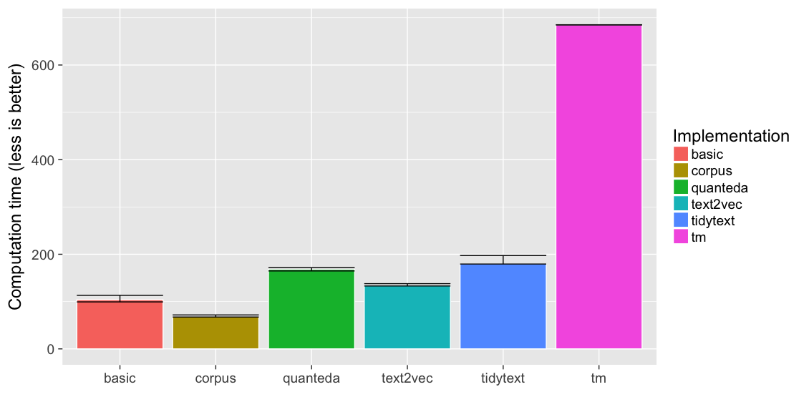
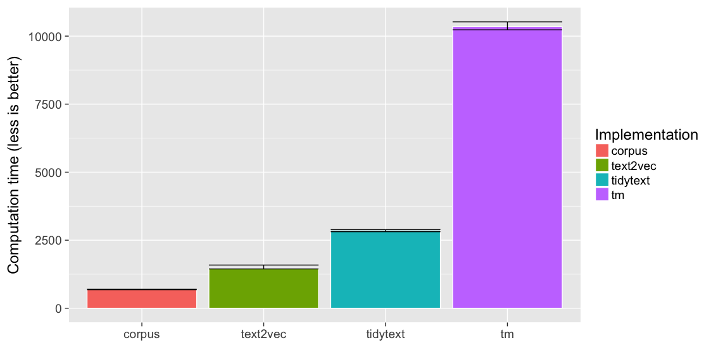

Term Matrix Comparison
======================

Overview
--------

There are multiple R packages that can transform text data into a matrix
of term frequency counts. This document benchmarks five packages:

-   [corpus](https://github.com/patperry/r-corpus)
-   [quanteda](https://github.com/kbenoit/quanteda)
-   [text2vec](http://text2vec.org/)
-   [tidytext](https://github.com/juliasilge/tidytext)
-   [tm](http://tm.r-forge.r-project.org/)

There are four benchmarks, two for unigrams only, and two for unigrams
and bigrams. In each benchmark, we perform the following sequence of
operations:

-   case fold the text
-   tokenize into words
-   remove puncuation
-   remove numbers
-   remove stop words
-   stem
-   compute bigrams (bigram benchmarks only)
-   compute term frequencies
-   remove terms that appear fewer than five times in the corpus
-   compute a term frequency matrix (text by term)

There are some subtle and not-so-subtle differences in how the five
packages implement these operations, so this is not really an
apples-to-apples comparison, and the outputs are different. Keep that in
mind.

*Note: For quanteda, we only benchmark unigram computations; quanteda
can compute bigrams, but in its current implementation (0.9.9.65) it is
orders of magnitude slower than the other packages. The quanteda authors
are working on fixing the issue.*

Prelude
-------

We will load the following packages.

    library("Matrix")
    library("dplyr", warn.conflicts = FALSE)
    library("ggplot2")
    library("magrittr")
    library("methods")
    library("stringr")

The remaining packages need to be installed, but we will not load their
namespaces:

    # Note: we use a development versions of text2vec
    #
    # Not run:
    # install.packages(c("corpus", "microbenchmark", "quanteda", "tidytext", "tm"))
    # devtools::install_github("dselivanov/text2vec@5a778fb517082c4a4a69f84dd5e9d045a18bc0bf")

For the first test corpus, we use the 62 chapters from *Pride and
Prejudice*, provided by the
[janeaustenr](https://github.com/juliasilge/janeaustenr) library:

    lines <- (data_frame(text = janeaustenr::prideprejudice)
              %>% mutate(
        linenumber = row_number(),
        chapter = cumsum(str_detect(text, regex("^chapter [\\divxlc]",
                                                ignore_case = TRUE)))))
    text_novel <- c(tapply(lines$text, lines$chapter, paste, collapse = "\n"))

For the second test corpus, we use the 5000 movie reviews provided by
the *text2vec* package:

    text_reviews <- text2vec::movie_review$review
    names(text_reviews) <- text2vec::movie_review$id

We will use the Snowball English stop word list:

    stop_words <- corpus::stopwords("english")

Implementations
---------------

### Basic

As a baseline, we will include a basic implementation, written from
scratch by Dmitriy Selivanov (*text2vec* author) that can handle
unigrams but not bigrams:

    # helper function for normalizing text, also used by text2vec below
    preprocess <- function(x)
    {
        # Note: this works fine for ASCII but not for general Unicode.
        # For Unicode, do the following instead:
        #
        # (stringi::stri_trans_nfkc_casefold(x)
        #  %>% stringi::stri_replace_all_regex("[^\\p{Letter}\\s]", ""))

        str_to_lower(x) %>% str_replace_all("[^[:alpha:]\\s]", "")
    }

    # helper function for tokenizing and stemming, also used by text2vec below
    stem_tokenizer <- function(x)
    {
        str_split(x, boundary("word")) %>% lapply(SnowballC::wordStem, "english")
    }

    matrix_basic <- function(text, min_count = 5)
    {
        # normalize and tokenize the text
        toks <- text %>% preprocess %>% stem_tokenizer
        toks_flat <- unlist(toks, recursive = FALSE, use.names = FALSE)

        # compute the text lengths
        ntok <- vapply(toks, length, 0L)

        # compute the types, remove stop words
        types <- unique(toks_flat) %>% setdiff(stop_words)

        # construct the term matrix
        i <- rep.int(seq_along(text), ntok)
        j <- match(toks_flat, types)
        drop <- is.na(j)
        x <- sparseMatrix(i = i[!drop], j = j[!drop], x = 1,
                          dims = c(length(text), length(types)),
                          dimnames = list(names(text), types),
                          check = FALSE)

        # drop terms below the minimum count
        x <- x[, colSums(x) >= min_count, drop = FALSE]
        x
    }

### corpus

    matrix_corpus <- function(text, bigrams = FALSE, min_count = 5)
    {
        if (bigrams) {
            ngrams <- 1:2
        } else {
            ngrams <- 1
        }
        f <- corpus::token_filter(stemmer = "english", drop_punct = TRUE,
                                  drop_number = TRUE, drop = stop_words)
        stats <- corpus::term_counts(text, f, ngrams = ngrams,
                                     min_count = min_count)
        x <- corpus::term_matrix(text, f, select = stats$term)
        x
    }

### quanteda

    matrix_quanteda <- function(text, bigrams = FALSE, min_count = 5)
    {
        if (bigrams) {
            ngrams <- 1:2
        } else {
            ngrams <- 1
        }
        x <- quanteda:::dfm(text, stem = TRUE, remove_punct = TRUE,
                           remove_numbers = TRUE, remove = stop_words,
                           ngrams = ngrams, verbose = FALSE)
        x <- quanteda::dfm_trim(x, min_count = min_count, verbose = FALSE)
        x
    }

### text2vec

    # Written by Dmitriy Selivanov
    matrix_text2vec <- function(text, bigrams = FALSE, min_count = 5)
    {
        if (bigrams) {
            ngram <- c(1, 2)
        } else {
            ngram <- c(1, 1)
        }

        # since we don't care about RAM usage we will tokenize everything only
        # once and do it with a single call to preprocess and tokenizer
        tokens <- preprocess(text) %>% stem_tokenizer
      
        it_train <- text2vec::itoken(tokens, n_chunks = 1, progressbar = FALSE)
        vocab <- text2vec::create_vocabulary(it_train, ngram = ngram,
                                             stopwords = stop_words)
        pruned_vocab <- text2vec::prune_vocabulary(vocab,
                                                   term_count_min = min_count)
        vectorizer <- text2vec::vocab_vectorizer(pruned_vocab)
        x <- text2vec::create_dtm(it_train, vectorizer)
        x
    }

### tidytext

    # Note: this filters punctuation but keeps numbers
    matrix_tidytext <- function(text, bigrams = FALSE, min_count = 5)
    {
        data <- tibble::tibble(text_id = seq_along(text), text = text)
        stops <- tibble::tibble(word = stop_words)

        # unigrams
        freqs <- (data
            %>% tidytext::unnest_tokens(word, text)
            %>% anti_join(stops, by = "word")
            %>% mutate(term = SnowballC::wordStem(word, "english"))
            %>% count(text_id, term)
            %>% ungroup())

        # bigrams
        if  (bigrams) {
            freqs2 <- (data
                %>% tidytext::unnest_tokens(bigram, text, token = "ngrams", n = 2)
                %>% tidyr::separate(bigram, c("type1", "type2"), sep = " ")
                %>% filter(!type1 %in% stop_words,
                           !type2 %in% stop_words)
                %>% mutate(type1 = SnowballC::wordStem(type1, "english"),
                           type2 = SnowballC::wordStem(type2, "english"))
                %>% mutate(term = paste(type1, type2))
                %>% count(text_id, term)
                %>% ungroup())

            freqs <- rbind(freqs, freqs2)
        }

        # form matrix in slam format
        x <- freqs %>% tidytext::cast_dtm(text_id, term, n)

        # remove rare terms
        x <- x[, slam::col_sums(x) >= min_count, drop = FALSE]

        # cast to dgCMatrix format
        x <- sparseMatrix(i = x$i, j = x$j, x = x$v, dims = dim(x),
                          dimnames = dimnames(x), check = FALSE)
        x
    }

### tm

    # from http://tm.r-forge.r-project.org/faq.html#Bigrams
    BigramTokenizer <- function(x)
    {
        unlist(lapply(NLP::ngrams(NLP::words(x), 2), paste, collapse = " "),
               use.names = FALSE)
    }

    matrix_tm <- function(text, bigrams = FALSE, min_count = 5)
    {
        corpus <- (tm::VCorpus(tm::VectorSource(text))
                   %>% tm::tm_map(tm::content_transformer(tolower))
                   %>% tm::tm_map(tm::removeWords, stop_words)
                   %>% tm::tm_map(tm::removePunctuation)
                   %>% tm::tm_map(tm::removeNumbers)
                   %>% tm::tm_map(tm::stemDocument, language = "english"))

        control <- list(wordLengths = c(1, Inf),
                        bounds = list(global = c(min_count, Inf)))

        x <- tm::DocumentTermMatrix(corpus, control = control)

        if (bigrams) {
            control$tokenize <- BigramTokenizer
            x2 <- tm::DocumentTermMatrix(corpus, control = control)

            x <- cbind(x, x2)
        }

        x <- sparseMatrix(i = x$i, j = x$j, x = x$v, dims = dim(x),
                          dimnames = dimnames(x), check = FALSE)
        x
    }

Caveats
-------

These implementations all give different results. See, for example, the
results on the following sample text:

    sample <- "Above ground. Another sentence. Others..."

    # compute term matrices using five implementations
    xs <- list(
        corpus   = matrix_corpus(sample, bigrams = TRUE, min_count = 1),
        quanteda = matrix_quanteda(sample, bigrams = TRUE, min_count = 1),
        text2vec = matrix_text2vec(sample, bigrams = TRUE, min_count = 1),
        tidytext = matrix_tidytext(sample, bigrams = TRUE, min_count = 1),
        tm       = matrix_tm(sample, bigrams = TRUE, min_count = 1))

    No features removed.

    # normalize the names (some use '_' to join bigrams, others use ' ')
    for (i in seq_along(xs)) {
        colnames(xs[[i]]) <- str_replace_all(colnames(xs[[i]]), " ", "_")
    }

    # get the unique terms
    terms <- unique(c(sapply(xs, colnames), recursive = TRUE))

    # put unigrams before bigrams, then order lexicographically
    terms <- terms[order(str_count(terms, "_"), terms)]

    # combine everything into a single matrix
    x <- matrix(0, length(xs), length(terms), dimnames = list(names(xs), terms))
    for (i in seq_along(xs)) {
        xi <- xs[[i]]
        x[i, colnames(xi)] <- as.numeric(xi[1, ])
    }

    print(as(x, "dgCMatrix"))

    5 x 9 sparse Matrix of class "dgCMatrix"
             abov anoth ground other sentenc abov_ground anoth_sentenc ground_anoth sentenc_other
    corpus      .     1      1     .       1           .             1            .             .
    quanteda    .     1      1     1       1           .             1            1             1
    text2vec    1     1      1     .       1           1             1            1             .
    tidytext    .     1      1     1       1           .             1            1             1
    tm          .     1      1     1       1           .             1            1             1

    print(sample)

    [1] "Above ground. Another sentence. Others..."

Some major differences between the implementations:

1.  With the *quanteda*, *tidytext*, and *tm* implementations, we remove
    stop words first, and then stem. With *text2vec*, we stem and then
    remove stop words. *Corpus* removes stop words after stemming and by
    default does not stem any words on the drop list. The word "other"
    is a stop word, but "others" is not. However, "others" stems to
    "other". *Corpus* and *text2vec* remove "others"; *quanteda*,
    *tidytext*, and *tm* replace "others" with a non-dropped "other"
    token. Another example: "above" is a stop word that stems to "abov".
    *Text2vec* replaces "above" with "abov" and keeps the token; the
    other packages drop "above".

2.  By design, *corpus* does not form bigrams across dropped tokens, in
    particular across dropped punctuation. The other packagages form
    bigrams from "ground. Another" and "sentence. Others"; corpus does
    not.

There are also differences in how the packages handle numbers and
punctuation. Beyond that, there are differences in the default output
formats, but we have converted everything to the *Matrix* `"dgCMatrix"`
format to make the outputs comparable. (By default, *corpus*,
*quanteda*, and *text2vec* return *Matrix* objects, but *tidytext* and
*tm* return *slam* objects.)

Results
-------

### Setup

First we benchmark the implementations:

    make_bench <- function(name, text, bigrams)
    {
        if (!bigrams) {
            results <- microbenchmark::microbenchmark (
                basic = matrix_basic(text),
                corpus = matrix_corpus(text, bigrams = FALSE),
                quanteda = matrix_quanteda(text, bigrams = FALSE),
                text2vec = matrix_text2vec(text, bigrams = FALSE),
                tidytext = matrix_tidytext(text, bigrams = FALSE),
                tm = matrix_tm(text, bigrams = FALSE),
            times = 5)
        } else {
            results <- microbenchmark::microbenchmark (
                corpus = matrix_corpus(text, bigrams = FALSE),
                # exclude quanteda; see note above
                # quanteda = matrix_quanteda(text, bigrams = FALSE),
                text2vec = matrix_text2vec(text, bigrams = FALSE),
                tidytext = matrix_tidytext(text, bigrams = FALSE),
                tm = matrix_tm(text, bigrams = FALSE),
            times = 5)
        }
        list(name = name, results = results)
    }

    plot_bench <- function(bench, title)
    {
        (ggplot(summary(bench$results),
                aes(x = expr, fill = expr, y = median, ymin = lq, ymax = uq))
         + geom_bar(color = "white", stat = "identity")
         + geom_errorbar()
         + scale_fill_discrete(name = "Implementation")
         + xlab("")
         + ylab("Computation time (less is better)"))
    }

Next, we present the results for the four benchmarks.

### Unigrams (novel)

    bench1 <- make_bench("Unigram, Novel", text_novel, bigrams = FALSE)
    plot_bench(bench1)

    print(bench1$results)

    Unit: milliseconds
         expr       min        lq      mean    median        uq      max neval
        basic  94.12127 111.55741 117.22329 115.39522 131.64480 133.3977     5
       corpus  63.98705  68.92664  74.50796  69.68685  84.86687  85.0724     5
     quanteda 169.88761 170.85599 192.41053 179.91193 191.87491 249.5222     5
     text2vec 124.11152 128.37635 147.93219 129.34434 146.34805 211.4807     5
     tidytext 161.76963 171.45061 191.36297 181.49958 215.04633 227.0487     5
           tm 711.39060 740.77539 742.84116 748.28904 754.62344 759.1273     5

### Unigrams (reviews)

    bench2 <- make_bench("Unigram, Reviews", text_reviews, bigrams = FALSE)
    plot_bench(bench2)

    print(bench2$results)

    Unit: milliseconds
         expr        min         lq       mean    median         uq        max neval
        basic  1084.9638  1165.4240  1294.0746  1236.335  1309.0316  1674.6182     5
       corpus   651.6232   663.5181   669.8379   672.396   680.1314   681.5206     5
     quanteda  2205.0992  2492.3904  2467.2541  2524.220  2545.1039  2569.4572     5
     text2vec  1462.4463  1470.3672  1549.7900  1538.160  1619.7885  1658.1881     5
     tidytext  2765.0679  2991.4207  2962.7001  2992.006  3010.8807  3054.1255     5
           tm 10124.3488 10224.0273 10982.8941 10821.844 11390.3560 12353.8940     5

### Bigrams (novel)

    bench3 <- make_bench("Bigram, Novel", text_novel, bigrams = TRUE)
    plot_bench(bench3)

    print(bench3$results)

    Unit: milliseconds
         expr       min        lq      mean    median        uq       max neval
       corpus  63.35596  64.23826  64.61024  64.58966  64.82431  66.04303     5
     text2vec 121.56959 123.47913 129.72582 123.50721 128.23036 151.84280     5
     tidytext 162.54288 168.31266 172.85007 169.81904 178.07108 185.50468     5
           tm 665.27105 667.79071 674.17955 671.88004 676.06751 689.88844     5

### Bigrams (reviews)

    bench4 <- make_bench("Bigram, Reviews", text_reviews, bigrams = TRUE)
    plot_bench(bench4)

    print(bench4$results)

    Unit: milliseconds
         expr        min         lq       mean     median         uq        max neval
       corpus   673.8201   678.5507   699.0681   697.7502   701.1378   744.0816     5
     text2vec  1417.0564  1445.0288  1518.7429  1471.3448  1586.5963  1673.6884     5
     tidytext  2639.8434  2812.3845  2852.0940  2863.3091  2886.5256  3058.4073     5
           tm 10220.6120 10230.9296 10599.6401 10344.5138 10523.1756 11678.9697     5

Summary
-------

*Corpus* is faster than the other packages, by at least a factor of 2
and as much as a factor of 10. What's going on here? The other packages
tokenize the text into a list of character vectors, then the process the
token lists to form the term matrices. *Corpus* instead bypasses the
intermediate step, going directly from the text to the term matrix
without constructing an intermediate "tokens" object. This is only
possible because all of the *corpus* normalization and tokenization is
written directly in C.

The downside of the *corpus* approach is flexibility: if you're using
*corpus*, you can't swap out the normalization or tokenizer for
something custom. With varying degrees of ease, the other packages let
you swap out these steps for your own custom functions.

Of course, there's more to text mining than just term matrices, so if
you need more, than *corpus* alone probably won't be sufficient for you.
The other packages have different strengths: *quanteda* and *text2vec*
provide a host of models and metrics; *tidytext* fits in well with "tidy
data" pipelines built on *dplyr* and related tools; *tm* has lots of
extension packages for data input and modeling. Choose the package that
best needs your needs.

Session information
-------------------

    sessionInfo()

    R version 3.4.0 (2017-04-21)
    Platform: x86_64-apple-darwin16.5.0 (64-bit)
    Running under: macOS Sierra 10.12.5

    Matrix products: default
    BLAS: /System/Library/Frameworks/Accelerate.framework/Versions/A/Frameworks/vecLib.framework/Versions/A/libBLAS.dylib
    LAPACK: /System/Library/Frameworks/Accelerate.framework/Versions/A/Frameworks/vecLib.framework/Versions/A/libLAPACK.dylib

    locale:
    [1] en_US.UTF-8/en_US.UTF-8/en_US.UTF-8/C/en_US.UTF-8/en_US.UTF-8

    attached base packages:
    [1] methods   stats     graphics  grDevices utils     datasets  base     

    other attached packages:
    [1] stringr_1.2.0     magrittr_1.5      dplyr_0.5.0       Matrix_1.2-9      quanteda_0.9.9-65 ggplot2_2.2.1    

    loaded via a namespace (and not attached):
     [1] NLP_0.1-10             Rcpp_0.12.11           compiler_3.4.0         plyr_1.8.4             tokenizers_0.1.4      
     [6] iterators_1.0.8        tools_3.4.0            digest_0.6.12          nlme_3.1-131           evaluate_0.10         
    [11] tibble_1.3.0           gtable_0.2.0           lattice_0.20-35        psych_1.7.5            fastmatch_1.1-0       
    [16] foreach_1.4.3          DBI_0.6-1              microbenchmark_1.4-2.1 parallel_3.4.0         janeaustenr_0.1.4     
    [21] knitr_1.16             text2vec_0.5.0         rprojroot_1.2          grid_3.4.0             data.table_1.10.4     
    [26] R6_2.2.1               foreign_0.8-67         rmarkdown_1.5          purrr_0.2.2.2          tidyr_0.6.3           
    [31] reshape2_1.4.2         backports_1.0.5        scales_0.4.1           codetools_0.2-15       SnowballC_0.5.1       
    [36] htmltools_0.3.6        corpus_0.7.0           mnormt_1.5-5           assertthat_0.2.0       tidytext_0.1.3        
    [41] colorspace_1.3-2       labeling_0.3           stringi_1.1.5          RcppParallel_4.3.20    lazyeval_0.2.0        
    [46] munsell_0.4.3          slam_0.1-40            tm_0.7-1               broom_0.4.2
